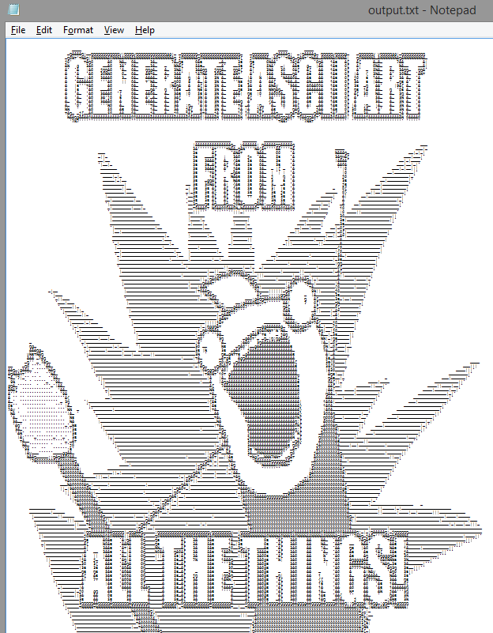

AsciiArtGenerator
=================

* Input an image  
* Specify the output font
	* This is due to the differences in characters from one font to another - this program takes that into account.
* Generate!

